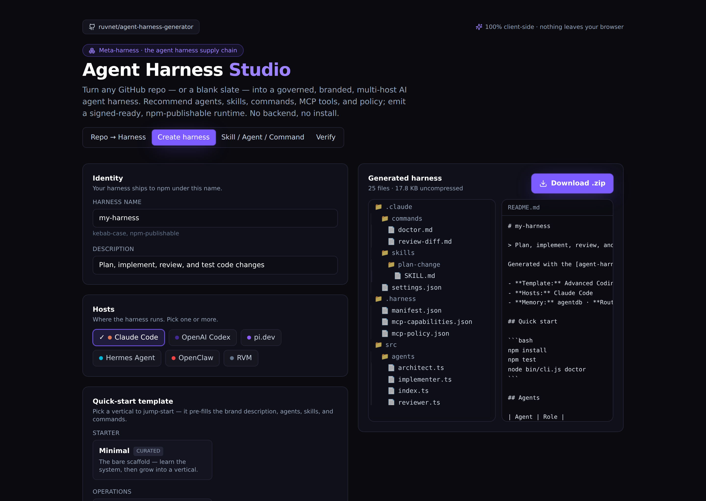

<div align="center">

# MetaHarness

### Mint a custom AI agent gemini from any repo.

`npx metaharness` · [open the Studio →](https://ruvnet.github.io/zagents-generator/)

<sub>(Repo: `cvsz/zagents-generator` · CLI: `metaharness` · Library: `@cvsz/zagents-generator`)</sub>

[](https://ruvnet.github.io/zagents-generator/)
[](docs/USERGUIDE.md)
[](docs/ARCHITECTURE.md)
[](https://github.com/cvsz/zagents-generator/actions/workflows/published-smoke.yml)
[](LICENSE)

[](https://ruvnet.github.io/zagents-generator/)

</div>

---

## What this is

**Every serious repo deserves its own agent.** A repo-aware CLI, a repo-aware coding agent, a local MCP server, memory scoped to the project, skills generated from the actual file layout, governance policy, release verification, witness-signed provenance.

`metaharness` mints those, on demand, from a GitHub URL or a blank slate. **It is not another agent framework. It is a factory for agent frameworks.**

The model is replaceable. The gemini is the product.

## What it gives you

In under 60 seconds, in your browser, with nothing leaving your machine:

- A custom AI agent gemini for your repo (or any repo)
- Recommended agents, skills, slash commands, MCP tools
- A scoped memory namespace + governance policy
- Witness-signed provenance + release gates
- Drops into Claude Code, OpenAI Codex, pi.dev, Hermes, OpenClaw, or RVM — pick one or all

Output is an npm-publishable `.zip` with **your name on it, your branding, your `npx <your-name>` CLI**.

### New

- **Score any repo before you build it.** `npx metaharness score <repo>` reads
  the repo (never runs it) and prints a one-screen report card — how well a
  gemini fits, how likely it is to build, how safe the tools are, and the
  rough **cost per run** — so you know what you'll get before scaffolding.
- **Pick the cheapest model that's good enough.** [`@metaharness/router`](https://www.npmjs.com/package/@metaharness/router)
  routes each request to the right model from your own results — same quality,
  far less spend. Works out of the box with zero native deps; **train it on your
  data** for a sharper fit (`npm i @metaharness/router`). Add the optional
  [`@ruvector/tiny-dancer`](https://www.npmjs.com/package/@ruvector/tiny-dancer)
  to train a fast native model instead — same training data, no API change.
- **Let your gemini improve itself.** Every scaffold now ships with **Darwin Mode**
  ([`@metaharness/darwin`](https://www.npmjs.com/package/@metaharness/darwin)) wired in —
  run `npm run evolve` and the gemini mutates its own config, tests each change in a
  sandbox, and keeps only what *measurably* improves. The model stays frozen; the gemini
  evolves. Safe by default (no network, no API key; pure refactor/tuning behind a safety
  gate). Validated on real **SWE-bench Lite** bug-fixing. `--no-darwin` to skip.

## Tune it to your project — then ship it as your own npm

A generated gemini is a **starting point you own**, not a fixed framework. Open
it and make it yours:

- **Keep only what your repo needs.** Delete the agents, skills, slash commands,
  and MCP servers you won't use — the scaffold ships a recommended set, but a
  payments service and a docs site want very different harnesses. A smaller,
  targeted gemini is faster, cheaper, and easier to reason about. `gemini
  doctor` / `gemini validate` keep it healthy as you trim.
- **Optimize the model routing for your work.** Swap the per-task model tiers,
  tighten the governance policy, point the memory namespace at your domain. The
  gemini is config you control, not a black box.
- **Publish it as your own package for the whole org.** Rename it, set your
  scope, and `npm publish` — now anyone on your team runs
  `npx @your-org/your-gemini` and gets the *same* repo-tuned agent. One
  command, org-wide, versioned like any other dependency. (The 19
  [`@metaharness/*`](examples-packages/) examples are exactly this pattern,
  published live.)

**Make older, cheaper models punch like frontier ones.** The right gemini
isn't a pile of extra steps bolted onto an expensive model — it's putting the
*right* model on each task and getting out of the way. Our [DRACO](packages/bench/draco/)
benchmark proves it: a small, cheap model delivers **frontier-quality** research
at roughly **one-tenth the cost**, and a smart router squeezes out the rest.
Stop paying frontier prices for work a $0.10 model does just as well.

That router ships as [`@metaharness/router`](https://www.npmjs.com/package/@metaharness/router)
— `route(query)` returns the cheapest model predicted to clear your quality bar,
learned from your own eval logs. `npm i @metaharness/router`.

## Try it in 30 seconds

```bash
# In the browser — zero install, nothing leaves the page
open https://ruvnet.github.io/zagents-generator/

# Or in the terminal — the same gemini (behaviourally equivalent output)
npx metaharness my-bot --template vertical:coding --host claude-code
cd my-bot && npx . --help
```

**Don't know what to pick?** Run the wizard:

```bash
npx metaharness --wizard
```

**Already have a repo you want a gemini for?**

```bash
gemini analyze-repo .                       # local — deterministic analysis only
gemini analyze-repo . --scaffold my-bot     # materialise the recommended gemini
```

No repository code is executed. Inferred build/test commands are emitted as `trust: inferred · execution: disabled`.

📖 **[Read the plain-language user guide →](docs/USERGUIDE.md)**

---

## Hosts

The same gemini output runs on **nine** agent hosts — eight interactive, plus GitHub Actions (CI/CD):

| Host | What ships | Notes |
|---|---|---|
| [**Claude Code**](https://code.claude.com/docs/en/mcp) | MCP server + hooks + 3-scope settings | Richest surface; Ruflo-native |
| [**OpenAI Codex**](https://developers.openai.com/codex) | MCP via `~/.codex/config.toml` | TOML, no hooks |
| [**pi.dev**](https://pi.dev/) | Pi extension via `pi.registerTool()` | No MCP by design |
| [**Hermes**](https://hermes-agent.nousresearch.com/docs/) | MCP runtime, `<think>` scrubbing | Per Hermes issue #741 |
| [**OpenClaw**](https://github.com/openclaw/openclaw) | `~/.openclaw/openclaw.json` + workspace skills | Personal-AI gateway |
| [**RVM**](https://github.com/ruvnet/rvm) | Bare-metal microhypervisor + capability tokens | Hardware isolation for untrusted peers |
| [**GitHub Copilot**](https://code.visualstudio.com/docs/copilot/mcp) | MCP via `.vscode/mcp.json` | VSCode 1.99+ (ADR-032) |
| [**OpenCode**](https://opencode.ai/) | MCP via `.opencode/opencode.json` | sst/opencode TUI (ADR-036) |
| [**GitHub Actions**](https://docs.github.com/actions) | `.github/workflows/` + composite `action.yml` | **Non-interactive** CI/CD; default-deny via `permissions:` (ADR-033) |

See [ADR-004 — Host integration model](docs/adrs/ADR-004-host-integration-model.md) and [ADR-033 — GitHub Actions host](docs/adrs/ADR-033-host-github-actions.md).

---

## MCP — modular, default-deny

MCP is included as a first-class **adapter surface, not the identity**. It is gated and default-deny ([ADR-022](docs/adrs/ADR-022-mcp-primitive.md)):

- Modes: `off` · `local` (stdio) · `remote` (HTTPS + auth)
- Emits `src/mcp/{server,tools,resources,prompts,policy,audit}.ts` + a scannable `.gemini/mcp-policy.json`
- Safe defaults: no network, no shell, no file-write, approve-dangerous, 30s timeout, 8 calls/turn, audit on
- `gemini mcp-scan <path>` — *"npm audit for agent tools"*: static-only scan flagging shell/network grants, missing audit/timeouts, wildcard permissions, unguarded secrets, unpinned deps. Exits 1 on any HIGH.

---

## Verticals (19 quick-start templates)

```bash
npx metaharness --list
npx metaharness my-bot --template vertical:coding
```

| Category | Templates |
|---|---|
| Starter / Operations | `minimal`, `vertical:devops` |
| Engineering | `vertical:coding`, `vertical:ai`, **`vertical:repo-maintainer`** (iter 113) |
| Knowledge | `vertical:research`, `vertical:ruview`, `vertical:education` |
| Finance / Pro | `vertical:trading`, `vertical:legal`, `vertical:health` |
| Customer / Growth | `vertical:support`, `vertical:crm`, `vertical:marketing`, `vertical:advertising`, `vertical:sales` |
| Business / Frontier | `vertical:business`, `vertical:agentics`, `vertical:gaming`, `vertical:exotic` |

Each ships bespoke domain agents (with system prompts), skills, commands, and per-host settings — all default-deny.

---

## One-command examples

Don't want to pick flags? Each host and vertical has a dedicated
`@metaharness/*` wrapper — **published, one `npx` away**, no template/host
flags to remember. A scaffold from a wrapper is byte-identical to the
equivalent `metaharness` invocation.

**Host integrations**

| Package | Scaffolds | npm |
|---|---|---|
| `npx @metaharness/claude-code my-bot` | Claude Code workspace + plugin | [](https://www.npmjs.com/package/@metaharness/claude-code) |
| `npx @metaharness/codex my-bot` | OpenAI Codex | [](https://www.npmjs.com/package/@metaharness/codex) |
| `npx @metaharness/hermes my-bot` | Hermes cli-config | [](https://www.npmjs.com/package/@metaharness/hermes) |
| `npx @metaharness/pi-dev my-bot` | pi.dev AGENTS.md | [](https://www.npmjs.com/package/@metaharness/pi-dev) |
| `npx @metaharness/openclaw my-bot` | OpenClaw `.openclaw/` | [](https://www.npmjs.com/package/@metaharness/openclaw) |
| `npx @metaharness/rvm my-bot` | RVM deployment partition | [](https://www.npmjs.com/package/@metaharness/rvm) |
| `npx @metaharness/copilot my-bot` | VSCode / Copilot `mcp.json` | [](https://www.npmjs.com/package/@metaharness/copilot) |
| `npx @metaharness/opencode my-bot` | OpenCode `.opencode/` | [](https://www.npmjs.com/package/@metaharness/opencode) |
| `npx @metaharness/github-actions my-bot` | GitHub Actions CI/CD (non-interactive) | [](https://www.npmjs.com/package/@metaharness/github-actions) |

**Vertical workflows** (ready-made multi-agent pods)

| Package | Scaffolds | npm |
|---|---|---|
| `npx @metaharness/devops my-bot` | incident response | [](https://www.npmjs.com/package/@metaharness/devops) |
| `npx @metaharness/research my-bot` | multi-source dossier | [](https://www.npmjs.com/package/@metaharness/research) |
| `npx @metaharness/trading my-bot` | quant trading (paper-by-default) | [](https://www.npmjs.com/package/@metaharness/trading) |
| `npx @metaharness/support my-bot` | customer support | [](https://www.npmjs.com/package/@metaharness/support) |
| `npx @metaharness/legal my-bot` | contract redline (drafts only) | [](https://www.npmjs.com/package/@metaharness/legal) |
| `npx @metaharness/repo-maintainer my-bot` | OSS repo maintainer | [](https://www.npmjs.com/package/@metaharness/repo-maintainer) |
| `npx @metaharness/coding my-bot` | engineering pod | [](https://www.npmjs.com/package/@metaharness/coding) |
| `npx @metaharness/education my-bot` | tutor pod | [](https://www.npmjs.com/package/@metaharness/education) |
| `npx @metaharness/sales my-bot` | sales pipeline pod | [](https://www.npmjs.com/package/@metaharness/sales) |
| `npx @metaharness/gaming my-bot` | game-design pod | [](https://www.npmjs.com/package/@metaharness/gaming) |

All 18 are live on npm under [`@metaharness`](https://www.npmjs.com/org/metaharness). Source + per-package README:
[`examples-packages/`](examples-packages/) · plain-language deep-dive gists:
[`examples-packages/GISTS.md`](examples-packages/GISTS.md).

---

## Day-to-day commands

After scaffolding, every gemini has a `gemini` CLI:

| You're trying to … | Subcommand |
|---|---|
| Smoke-check the scaffold | `gemini doctor` |
| Run every release gate | `gemini validate` |
| Check kernel ↔ gemini compatibility | `gemini diag` |
| Score the gemini 0-100 with badges | `gemini score` |
| Pre-scaffold: is this REPO ready for an agent? | `gemini genome <repo>` |
| Pre-scaffold: fit/cost/safety report card for a repo | `metaharness score <repo>` |
| MCP threat-model artifact for a PR review | `gemini threat-model` |
| Declare OIA v0.1 layer alignment | `gemini oia-manifest` |
| File a useful support ticket | `gemini diag --bundle > bundle.json` |
| Diff two harnesses | `gemini compare a/ b/` |
| Share MCP + Bash + claims config for review | `gemini export-config` |
| Run npm-audit per-gemini | `gemini audit --bundle > audit.json` |
| Emit SPDX-2.3 SBOM | `gemini sbom` |
| Drift-detect against the latest template | `gemini upgrade` |
| Sign / verify the witness | `gemini sign` · `gemini verify` |
| Pin the manifest to IPFS | `gemini publish --confirm` |
| Recommend a gemini from a repo | `gemini analyze-repo` |

21 subcommands total. Every one respects `--help` / `-h`. Shell completion: `gemini completions bash | zsh | fish`.

📖 Full reference: [docs/USAGE.md](docs/USAGE.md)

---

## Status

**v0.1.x beta** — published and usable, with the credibility/doc reconciliation in
issue #4 / ADR-042 in progress. The release *pipeline* is mature: CI matrix green
across Rust × 3 OS + WASM × 3 OS + Node 20+22 × 3 OS + Bench + pack+install × 3 OS
+ a CI-passed aggregator; single-command releases (`node scripts/release.mjs <bump>
--push`) atomically bump 15 sources, run all gates, and tag.

| Layer | Status |
|---|---|
| Rust kernel (WASM + NAPI-RS) | Shipped — 7 subsystems |
| 6 host adapters | claude-code · codex · pi-dev · hermes · openclaw · rvm |
| 17 `gemini` subcommands | Shipped |
| 7 Codex skills | Shipped |
| Claude marketplace plugin | Shipped + schema-validated |
| Witness signing (Ed25519) | Shipped + tamper-tested |
| MCP tool dispatch | 11 end-to-end cases |
| Test suite | **568/568** across 67 files |
| CI matrix | 16 jobs green |
| Security pipeline | cargo-audit · cargo-deny · npm-audit · CodeQL · SBOM (SPDX-2.3) |
| Publish pipeline | GCP WIF + 2 gates + 11 packages + IPFS pin |
| Agent Gemini Studio | Live at <https://ruvnet.github.io/zagents-generator/> |

---

## Architecture in 30 seconds

```
You (gemini author)
   └→ zagents-generator    ← the factory
        └→ Your gemini (.zip)    ← what you ship
             ├ npx <your-name>     ← your identity
             ├ <your agents>       ← your content
             └ @metaharness/kernel       ← shared primitives (Rust + WASM + NAPI-RS)
                  └→ Host adapter (Claude Code / Codex / pi.dev / Hermes / OpenClaw / RVM)
                       └→ LLM providers
```

You operate the factory. The factory produces your gemini. Your users never see the factory — only the brand and CLI you ship. The kernel ships as `@metaharness/kernel` (Rust → wasm-pack + NAPI-RS); your content stays yours.

📖 Deeper: [docs/ARCHITECTURE.md](docs/ARCHITECTURE.md) · [docs/adrs/INDEX.md](docs/adrs/INDEX.md) (31 ADRs)

---

## Quality gates

| Concern | Where |
|---|---|
| **CI** | [`ci.yml`](.github/workflows/ci.yml) — Rust 3-platform × fmt/clippy/test/doc + WASM build + size budget + Node 20/22 × 3-platform |
| **Publish** | [`publish.yml`](.github/workflows/publish.yml) — GCP WIF → Secret Manager → smoke → `npm publish --provenance` (SLSA L2) |
| **Security** | [`security.yml`](.github/workflows/security.yml) — cargo-audit + cargo-deny + npm-audit + CodeQL + weekly cron |
| **Provenance** | [ADR-011](docs/adrs/ADR-011-witness-and-provenance.md) — Ed25519-signed witness manifest, byte-deterministic across runners |
| **Studio liveness** | [`pages-monitor.yml`](.github/workflows/pages-monitor.yml) — daily HTTP probe of live Studio |
| **Research quality (DRACO)** | [`draco.yml`](.github/workflows/draco.yml) — cross-domain deep-research benchmark ([ADR-037](docs/adrs/ADR-037-draco-deep-research-benchmark.md)). Deterministic subset gates the scorer/runner machinery on every push (offline); a weekly judged cadence runs the real OpenRouter-fusion score. 5 dimensions (grounding/coverage/balance/cleanliness/faithfulness); the verifier + judge are different model families than the synthesizer (fusion). See [`packages/bench/draco/`](packages/bench/draco/). |

---

## Developer quick-start

```bash
git clone https://github.com/cvsz/zagents-generator
cd zagents-generator

cargo test --workspace
cargo clippy --workspace --all-targets -- -D warnings

npm install
npm run build:wasm
npm test
node scripts/healthcheck.mjs
```

See [CONTRIBUTING.md](CONTRIBUTING.md).

---

## Related

- [**ruflo**](https://github.com/ruvnet/ruflo) — the meta-gemini this generator factors apart
- [**ruvector**](https://github.com/ruvnet/ruvector) — vector + agentic database (memory backend)
- [**@ruvector/emergent-time**](https://www.npmjs.com/package/@ruvector/emergent-time) — memory-decay clock the kernel uses

## License

MIT — see [LICENSE](LICENSE).

## FAQ

### What is MetaHarness?

MetaHarness is a CLI and browser Studio that turns any GitHub repo (or a
blank slate) into a custom AI agent gemini. The output is a branded,
npm-publishable package with its own `npx <name>` CLI, MCP server, memory,
governance policy, and Ed25519 witness-signed releases. Runs on Claude
Code, OpenAI Codex, pi.dev, Hermes, OpenClaw, and RVM.

### How is MetaHarness different from an agent framework?

Frameworks help **developers** build agents. MetaHarness helps
**repositories** ship agents. The model is replaceable; the gemini is
the product.

### Do I need to run a server?

No. The Studio is 100% client-side (GitHub Pages). The CLI runs locally.
There is no MetaHarness account, no hosted backend, no telemetry.

### Does it execute my code during analysis?

No. `metaharness analyze` and `metaharness genome` are deterministic
static-analysis only. Inferred build/test commands are marked
`trust: inferred · execution: disabled`.

### Which agent runtimes does it support?

Six today: Claude Code, OpenAI Codex, pi.dev, Hermes (Nous Research),
OpenClaw, and RVM. GitHub Copilot and GitHub Actions are proposed in
ADR-032 and ADR-033.

### What languages does it understand?

Rust, TypeScript / JavaScript, Python, and Go are detected
deterministically via lockfile and manifest probing. Lexical scoring is
the default; optional in-browser MiniLM embeddings via Transformers.js
boost recall for unusual repos.

### Is the output really npm-publishable?

Yes — the generated gemini ships with `package.json`, `bin`, a working
CLI, and `gemini validate` to gate releases. `gemini sign` adds the
Ed25519 witness; `gemini sbom` emits SPDX-2.3.

---

> **Keywords:** metaharness, AI agent CLI, AI agent scaffold, AI agent generator, repo to agent, GitHub repo to AI agent, agent gemini, agent gemini generator, agent framework alternative, agentic AI, agentic workflow, autonomous AI agents, multi-agent framework, multi-agent system, MCP, MCP server, model context protocol, Claude Code plugin, OpenAI Codex plugin, Anthropic agents, GPT agent, Codex agent, pi.dev extension, hermes agent, Nous Research, OpenClaw, RVM agent, vertical AI agents, custom AI CLI, npx metaharness, npm create AI agent, Rust WASM agent kernel, NAPI-RS, wasm-bindgen, agent memory, ReasoningBank, HNSW vector search, emergent time, witness manifest, Ed25519 signed, provenance, SBOM, SPDX, SLSA, plugin marketplace, IPFS registry, drift detection, anti-slop, TDD agents, self-evolving agents, federated agents, swarm intelligence, GCP Workload Identity Federation, Secret Manager, npm provenance, repo-aware AI, repo-native CLI, repo factory.
